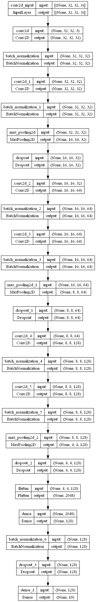
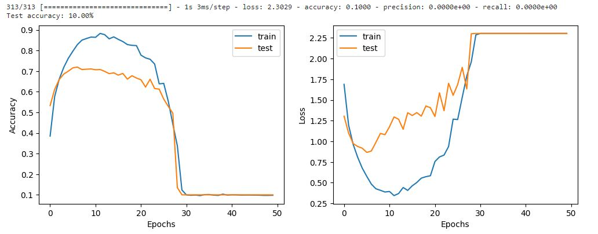
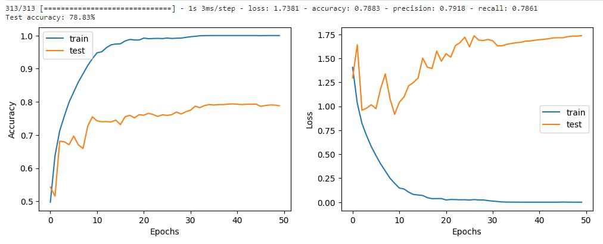
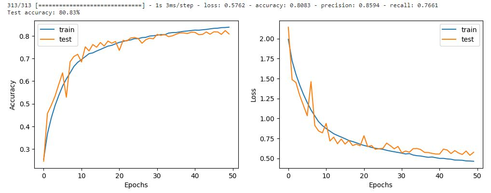
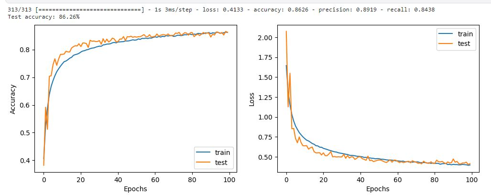
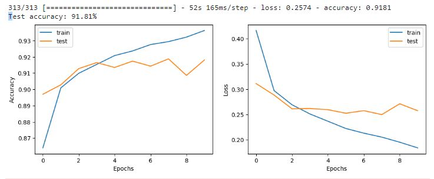

# Image Classification using Convolutional Neural Networks (CNNs)

## Overview

Welcome to the Image Classification project utilizing Convolutional Neural Networks (CNNs). This project aims to develop a robust image classification system capable of accurately categorizing images into predefined classes using state-of-the-art deep learning techniques.

## Table of Contents

- [Key Components](#key-components)
- [Getting Started](#getting-started)
- [CNN Architecture](#2-cnn-architecture-design)
- [Challenges](#challenges)
- [model's performance](#5-models-performance)
- [Deployment](#deployment--access)
## Key Components

### 1. Dataset Selection and Preprocessing

The CIFAR-10 dataset is available through the [CIFAR-10 website](https://www.cs.toronto.edu/~kriz/cifar.html). You can download the dataset from the official website or use a library such as TensorFlow or PyTorch to access it programmatically.

#### Dataset Preprocessing

1. **Resizing:**
   - The images in the CIFAR-10 dataset are 32x32 pixels. Depending on the requirements of your CNN architecture, you may need to resize the images. Ensure consistency in image dimensions across the dataset.

2. **Normalization:**
   - Normalize the pixel values of the images to a range between 0 and 1. This ensures numerical stability during training and convergence.

3. **Augmentation (Optional):**
   - Consider applying data augmentation techniques to artificially increase the size of the training dataset. Common augmentations include random rotations, flips, and shifts, which can improve the model's generalization.

### 2. CNN Architecture Design

- I selected this model architecture based on its simplicity and efficiency for image classification tasks. The combination of Conv2D layers allows the model to learn hierarchical features from the input images, while the MaxPooling2D layers help reduce spatial dimensions and computational complexity. The design strikes a balance between complexity and performance, making it suitable for the task at hand.



- Initially, a basic model was constructed with three Conv2D layers and one Dense layer. However, it was observed that the model was underfitting.
- To address the underfitting issue, a more complex architecture was developed, consisting of three blocks. Each block comprises a sequence of Conv2D, Conv2D, and MaxPooling2D layers.

### 3. Training and Validation

- Split the dataset into training and validation sets (train =5K , validation=1K)
- Scale the input to range from 0 to 1

## Challenges

## Baseline Model



- As observed in the figure, the model failed to learn anything after 10 epochs, and this occurred due to the issue of vanishing gradients

## Baseline Model + BatchNormalization



- Implementing normalization after the Conv2D layer to enhance the model's learning capacity
- If you observe in the model training you can see that Validation loss is increasing a lot which means our model is overfitting.

## Baseline Model + BatchNormalization + Dropout



- So let's regularize the model. In deep learning, dropout is a very good form of regularization.


## Baseline Model + BatchNormalization + Dropout + Data Augmentation



- To reduce overfitting, we agreed that adding more data will reduce overfitting. Even when our model doesn't overfit, it's a very good idea to add more data if you can. But collecting data is tough, and also data preprocessing is not as fancy as it sounds. But what if we can generate data from our existing data? We already have 60K images, and we can generate lots and lots of images out of it.

## Additional improvement through Transfer Learning

- Since the training images are relatively small (32x32), and real-world photos are typically larger, there is a discrepancy in the data distribution between training and inference. To address this issue, two potential solutions can be considered:

    - Re-train the Model: Acquire and use a new dataset that better represents the distribution of real-world images. Training the model on this new data can help align the model's understanding with the characteristics of larger photos.

    - Transfer Learning: Leverage transfer learning by using a pre-trained model on a larger dataset and fine-tuning it on the smaller dataset. This approach allows the model to benefit from knowledge gained during training on extensive data while adapting to the specifics of the smaller dataset.



- I haven't integrated this into my code; it's attached as a separate notebook, providing additional insights for my task.
- Employed a pretrained model, InceptionResNetV2, utilizing transfer learning to enhance accuracy by freezing all its layers.
- Further improvement can be achieved by unfreezing specific layers."

### 5. model's performance

- Note: All these results are based on GPU P100.

## Baseline Model + BatchNormalization
- accuracy: 0.78 - precision: 0.79 - recall: 0.78 - F1_score: 0.78

## Baseline Model + BatchNormalization + Dropout
- accuracy: 0.80 - precision: 0.85 - recall: 0.76 - F1_score: 0.80

## Baseline Model + BatchNormalization + Dropout + Data Augmentation
- accuracy: 0.86 - precision: 0.89 - recall: 0.84 - F1_score: 0.86

## Deployment & Access

- This app is available for you to interact with on Streamlit.
- Visit the app: Streamlit (https://in3img.streamlit.app/)

## Getting Started

To get started with the project, follow these steps:

1. Clone the repository.
2. Install requirements:
    ```bash
    pip install -r requirements.txt
    ```
3. Run unittest:
    ```bash
    python src\unit_test.py
    ```
4. For training the model again:
    ```bash
    python src\model_building.py
    ```
5. For evaluating the model:
    ```bash
    python src\model_evaluation.py
    ```
6. For prediction:
    1. Streamlit
    ```bash
     streamlit run src\streamlit_app.py
    ```
    OR 

    1. Assign the image you want to be classified to `img_path`.
    2. Run:
    ```bash
    python src\predict.py
    ```
